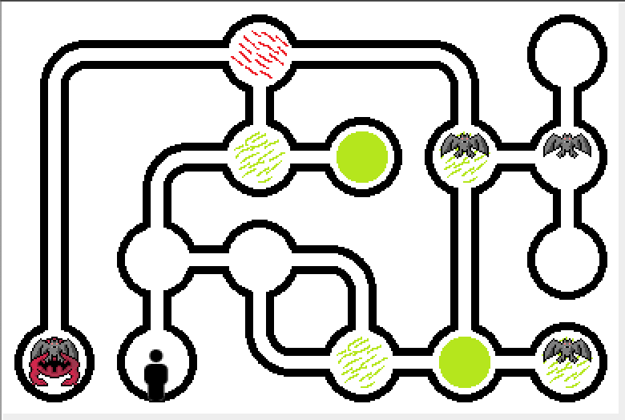
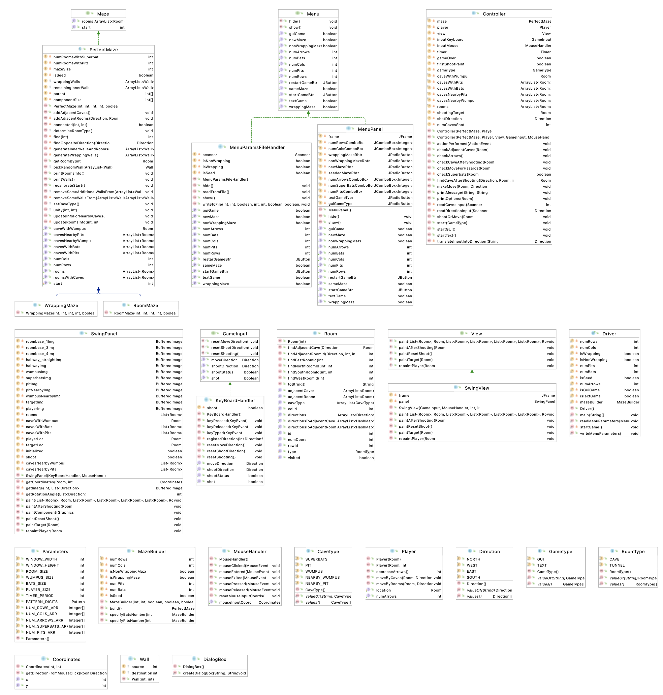

</img>

# HWT - Hunt the Wumpus

Java-based implementation of the ‘73 classics ["Hunt the Wumpus"](https://en.wikipedia.org/wiki/Hunt_the_Wumpus), using MVC design pattern. 
The game can be played in both GUI and text-based modes.

# Demo
</img>

# UML Diagram

</img>
